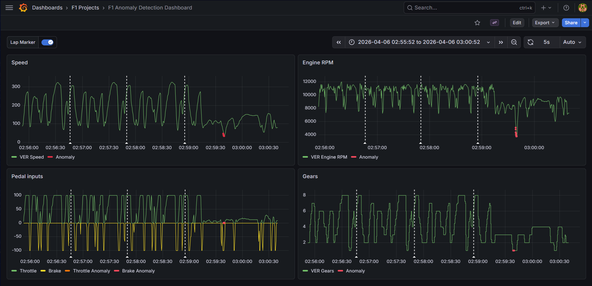

# Real-Time F1 Anomaly Detection: Verstappen's 2026 Chinese GP Failure

This project implements a real-time anomaly detection system for Formula 1 telemetry, leveraging a modern data engineering stack and a Python-based machine learning model to precisely diagnose catastrophic mechanical failures on the fly. 

We showcase this system's power through a detailed case study of Max Verstappen's DNF in the 2026 Chinese Grand Prix.

## Architecture Overview

Our system is engineered as a fully Dockerized, zero-touch deployment stack, ensuring reproducibility and ease of use:

* **Real-time Data Stream:** Telemetry data is streamed via a high-throughput **Apache Kafka** cluster.
* **Stream Processing & ML:** A Python **Consumer** script continuously reads the stream, processes data in real-time, and executes an **Isolation Forest** anomaly detection model.
* **Persistent Storage:** All telemetry and anomaly flags are routed directly into an **InfluxDB** time-series database.
* **Professional Visualization:** A world-class, **provisioned Grafana** dashboard automatically waits for the data, providing a synchronized pit-wall interface that precisely visualizes both raw telemetry and flagged anomalies.

## Model Training Strategy: The 2026 Regulation Challenge

The 2026 F1 regulation cycle introduced drastically different car dynamics, rendering historical telemetry data obsolete for accurate anomaly detection. 

To overcome this data scarcity, the Isolation Forest model was trained specifically on telemetry gathered from the **2026 Chinese Grand Prix Sprint Race** held earlier in the weekend. This approach ensured the model was calibrated to the exact aero and power unit characteristics of the new generation of cars under identical track conditions.

## Case Study: Verstappen's 2026 Chinese GP Gearbox Failure

This case study focuses on the critical drivetrain failure suffered by Max Verstappen during the 2026 Chinese Grand Prix. As evident in the telemetry graphs below, our system successfully detected and visualized the breakdown in real-time.



### The Takeaway

The telemetry makes the failure patently obvious. As visualized by the dashboard:

* **RPM and Speed dramatically drop** as the drivetrain chokes.
* Despite continued throttle application (visible in the pedal input trace), **Max is completely unable to shift into gears 5, 6, 7, and 8, remaining stuck at a maximum of 4th gear.**
* Our Isolation Forest model precisely flags this massive operational breakdown as a dense cluster of red anomaly dots, providing immediate, diagnostic confirmation of a critical mechanical issue.

## Getting Started

Follow these steps to deploy and run the entire F1 anomaly detection stack.

1. **Prerequisites:** Ensure you have **Docker**, **Docker Compose**, and **Python** installed on your machine.

2. **Clone the Repository:**
   ```bash
   git clone [https://github.com/VR952004/Real-time-Anomaly-detection-in-F1.git](https://github.com/VR952004/Real-time-Anomaly-detection-in-F1.git)
   cd Real-time-Anomaly-detection-in-F1